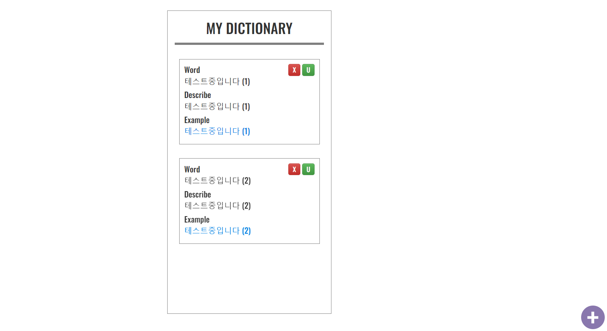

# react-my-dictionary

- `Firebase`를 연동한 나만의 단어장

## Installation

```bash
# Default.
$ yarn create react-app
$ yarn add react-router-dom@5.3.0
$ yarn add redux react-redux
$ yarn add firebase
$ yarn add styled-components
$ yarn add redux-thunk


# Start!
$ yarn start
```

## Specs

- React
- Firebase

<br />



단어장 `작성`, `수정`, `삭제` 기능 구현  
`overflow: auto`, `overflow: hidden` 관련 스크롤 적절히 활용
<br />

## middlewares (redux-thunk)

```javascript
export const loadWordFB = () => {
  return async function (dispatch) {
    const firestore_word_list = await getDocs(collection(db, "word"));

    let word_list = [];
    firestore_word_list.forEach((doc) => {
      // word_list = [...word_list, {...doc.data()}]
      word_list.push({ id: doc.id, ...doc.data() });
    });

    // console.log(word_list);
    dispatch(loadWord(word_list));
  };
};
```

## Dictionary component

```javascript
const Dictionary = (props) => {
  const history = useHistory();
  const dispatch = useDispatch();

  return (
    <div className="dictionary_container">
      {props.list.map((v, i) => {
        // console.log(v);
        return (
          <div key={i} className="word_list_box">
            <div className="word_box">
              <div className="word_box_title">Word</div>
              {v["title"]}
            </div>

            <div className="word_box">
              <div className="word_box_title">Describe</div>
              {v["desc"]}
            </div>

            <div className="word_box">
              <div className="word_box_title">Example</div>
              <div className="word_box_ex">{v["ex"]}</div>
            </div>

            <button
              type="button"
              className="btn btn-danger"
              onClick={() => {
                // dispatch(deleteWord(i));
                dispatch(deleteWordFB(v.id));
              }}
            >
              X
            </button>

            <button
              type="button"
              className="btn btn-success"
              onClick={() => {
                history.push(`addword/${v.id}`);
              }}
            >
              U
            </button>
          </div>
        );
      })}
    </div>
  );
};

export default Dictionary;
```
